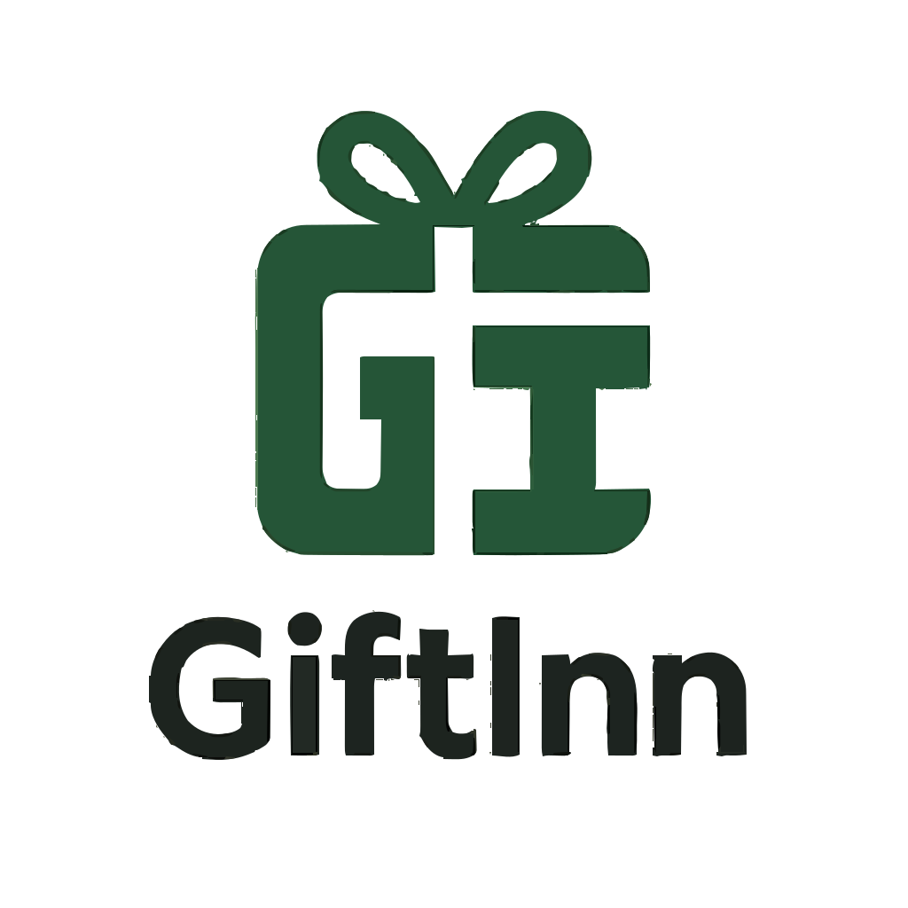

# GiftInn Musanze - Luxury Hotel Website

<p align="center">
  
</p>

<p align="center">
  A premium, editorial-style hotel website for <strong>GiftInn Musanze</strong>, built with React + Vite.
  It combines luxury UI/UX, room discovery, booking flows, live notifications, and PWA-ready behavior.
</p>

<p align="center">
  
  
  
  
</p>

---

## Table of Contents

1. [Overview](#overview)
2. [Design System](#design-system)
3. [Core Features](#core-features)
4. [Pages & User Flow](#pages--user-flow)
5. [Animated Timeline](#animated-timeline)
6. [Video Showcase](#video-showcase)
7. [Project Structure](#project-structure)
8. [Local Setup](#local-setup)
9. [PWA & Notifications](#pwa--notifications)
10. [Deployment Notes](#deployment-notes)
11. [Future Upgrades](#future-upgrades)

---

## Overview

GiftInn Musanze is designed as a modern boutique-hotel experience on the web.
The interface is intentionally editorial and luxurious, using warm gold accents, deep charcoal backgrounds, and a high-end serif/sans pairing to communicate trust and exclusivity.

### Goals

- Present the hotel as a premium destination in Musanze.
- Convert visitors to bookings with low-friction flows.
- Support live guest communication (in-app + device notifications).
- Be installable as an app-like PWA with branded shortcuts.

---

## Design System

### Visual Direction

- **Style:** Editorial luxury (inspired by premium travel brands)
- **Mood:** Elegant, calm, aspirational
- **Layout Rhythm:** Alternating dark/light content chapters, large image cards, clear CTAs

### Brand Palette

- `#c8a96e` - Warm Gold (premium accents)
- `#1a1410` - Deep Charcoal Brown (grounded luxury)
- `#faf8f3` - Warm Ivory (soft premium canvas)
- `#5a4e42` - Supporting warm text tone
- `#e8e0d0` - Sand borders/dividers

### Typography

- **Cormorant Garamond** for hero/headlines/editorial identity
- **Jost** for body text/navigation/form controls

---

## Core Features

- Premium hero experience with parallax feel and cinematic overlays
- Fully responsive luxury navbar + mobile menu
- Room listing grid with interactive overlays
- Dedicated room details page with gallery and metadata
- Booking overlay/form from room details
- Full booking page with availability and payment-method selection
- Live in-app notifications + device/browser notifications
- Notification permission prompt for user device
- PWA support: manifest, service worker, app shortcuts, branded icon assets
- WhatsApp + Email booking request handoff
- Live chat widget with transcript forwarding
- Multi-language structure (EN/RW/FR)

---

## Pages & User Flow

### Main Pages

- `/` - Home (brand overview + premium storytelling)
- `/rooms` - Rooms listing
- `/rooms/:id` - Room details + gallery + booking overlay
- `/booking` - Full booking workflow
- `/about` - Story, values, location
- `/amenities` - Services grid
- `/gallery` - Visual showcase + virtual tour section
- `/reviews` - Testimonials
- `/contact` - Contact + map
- `/blog` - SEO/marketing updates

### Booking Funnel

1. Browse room cards
2. Open room details
3. Click **Book Now**
4. Complete overlay form:
   - Name
   - Phone
   - Check-in / Check-out (date + time)
   - Room type
   - Guests
   - Payment method
5. Submit request to WhatsApp + Email

---

## Animated Timeline

This timeline represents the premium user journey from discovery to conversion.

### Experience Timeline

1. **Landing Hero**
Visitor sees cinematic brand intro and core CTA.
2. **Room Discovery**
User browses room cards and opens room detail gallery.
3. **Booking Intent**
User taps **Book Now** and opens the booking overlay.
4. **Reservation Submission**
User fills name, phone, check-in/out, room type, guests, payment method.
5. **Live Confirmation**
In-app + device notifications confirm that booking request was sent.

### Animated Timeline Snippet (for docs pages)

```html
<ul class="timeline">
  <li>Landing Hero</li>
  <li>Room Discovery</li>
  <li>Booking Intent</li>
  <li>Reservation Submission</li>
  <li>Live Confirmation</li>
</ul>
```

```css
.timeline {
  list-style: none;
  margin: 0;
  padding: 0;
  position: relative;
  max-width: 720px;
}

.timeline::before {
  content: "";
  position: absolute;
  left: 12px;
  top: 0;
  bottom: 0;
  width: 2px;
  background: #c8a96e;
}

.timeline li {
  position: relative;
  margin: 0 0 18px 32px;
  padding: 10px 14px;
  border: 1px solid #e8e0d0;
  background: #faf8f3;
  animation: timelineFade 0.6s ease both;
}

.timeline li::before {
  content: "";
  position: absolute;
  left: -27px;
  top: 16px;
  width: 10px;
  height: 10px;
  border-radius: 999px;
  background: #c8a96e;
  box-shadow: 0 0 0 0 rgba(200, 169, 110, 0.5);
  animation: pulse 1.6s infinite;
}

.timeline li:nth-child(1) { animation-delay: 0.1s; }
.timeline li:nth-child(2) { animation-delay: 0.25s; }
.timeline li:nth-child(3) { animation-delay: 0.4s; }
.timeline li:nth-child(4) { animation-delay: 0.55s; }
.timeline li:nth-child(5) { animation-delay: 0.7s; }

@keyframes timelineFade {
  from { opacity: 0; transform: translateY(10px); }
  to { opacity: 1; transform: translateY(0); }
}

@keyframes pulse {
  0% { box-shadow: 0 0 0 0 rgba(200, 169, 110, 0.5); }
  100% { box-shadow: 0 0 0 12px rgba(200, 169, 110, 0); }
}
```

---

## Video Showcase

Use this section to attach walkthroughs for clients, investors, or team demos.

### Suggested Demo Videos

- **Home + Luxury UI Tour**
- **Rooms to Booking Flow**
- **Realtime Notifications + PWA Install**

### Video Links (Replace with your own)

- `Home Tour:` https://your-video-link.com/home-tour
- `Booking Walkthrough:` https://your-video-link.com/booking-flow
- `PWA + Notifications:` https://your-video-link.com/pwa-notifications

### Optional Embedded Video Block

```html
<video width="100%" controls>
  <source src="docs/videos/giftinn-demo.mp4" type="video/mp4" />
</video>
```

---

## Project Structure

```text
src/
  components/
    Navbar.jsx
    Footer.jsx
    ChatWidget.jsx
    NotificationCenter.jsx
    NotificationPermissionPrompt.jsx
    RoomCard.jsx
  context/
    LanguageContext.jsx
    NotificationContext.jsx
  data/
    siteContent.js
  hooks/
    useRealtimeAvailability.js
    useSeo.js
  pages/
    HomePage.jsx
    RoomsPage.jsx
    RoomDetailsPage.jsx
    BookingPage.jsx
    AboutPage.jsx
    AmenitiesPage.jsx
    GalleryPage.jsx
    ReviewsPage.jsx
    ContactPage.jsx
    BlogPage.jsx
public/
  manifest.json
  sw.js
  icons/
    giftinn-logo.svg
    giftinn-badge.svg
```

---

## Local Setup

```bash
npm install
npm run dev
```

### Build

```bash
npm run build
npm run preview
```

### Lint

```bash
npm run lint
```

---

## PWA & Notifications

### Included

- `public/manifest.json` with app shortcuts
- `public/sw.js` service worker registration
- Device notification permission request UI
- Native notifications for in-app live updates

### Important

Device notifications require:

- HTTPS in production
- Browser permission granted by the user

---

## Deployment Notes

- Works on Vite-compatible hosts (Vercel, Netlify, Render, VPS)
- Ensure static files from `public/` are served at root (`/manifest.json`, `/sw.js`, `/icons/*`)
- Configure HTTPS for full notification and PWA behavior

---

## Future Upgrades

- Real payment gateway integration (Stripe/Flutterwave/PayPal)
- Real booking backend + room availability API
- Admin dashboard for reservation management
- Push notification backend (FCM/Web Push)
- CMS-backed blog + offers manager

---

## License

This project is currently intended for GiftInn product development and customization.
